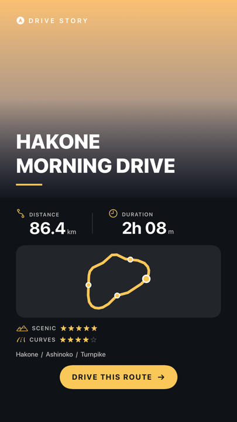
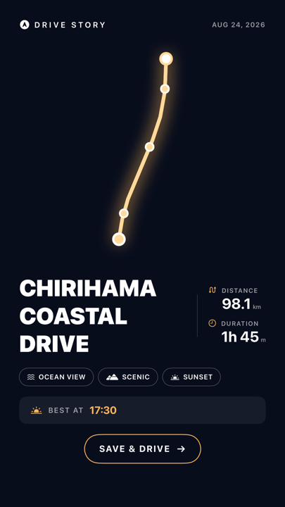
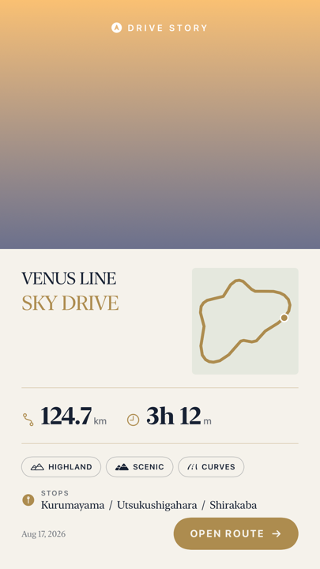
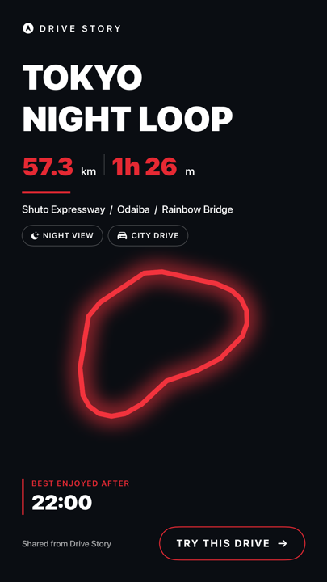

# Drive Story

ドライブの走行ログと写真から、**そのまま SNS に貼れる 9:16 の 1 枚**を自動生成する iOS アプリ。

大学のプロジェクトです。全機能無料で、課金・サブスクリプション・広告は実装しません。

---

## 何を作るのか

走り終わって「終了」を押すと、ルートの形・地名・距離・所要時間・写真が入った 1080×1920 の画像ができます。
下は実際にレンダラが書き出したもの（走行データはサンプル）。

| Scenic | Route | Editorial | Night |
|---|---|---|---|
|  |  |  |  |
| 実写が主役 | ルートが主役 | 雑誌組版 | 黒×赤・写真 0 枚でも成立 |

## 記録アプリではなく、変換アプリ

GPS ロガーは既に成熟していて、機能競争に入る意味がありません（`doc/COMPETITORS.md`）。
一方、走行データを「そのまま貼れる 1 枚」に変換する部分は、車のドライブ向けにはどこも作っていません。
Relive（アクティビティ → 動画）や Strava の Stats Stickers は隣接しますが、前者は自転車・ランの速度域の演出で、
後者はルートの線画だけで**地名がありません**。車のドライブは「どこを走ったか」が主語です。

このアプリで一番大事な画面は、ホームでも記録中でもなく、**走り終わった直後の Story プレビュー**です。

## 設計上の決定

- **地図タイルを使わず、ルートを自前で描く。** タイル画像を焼いて SNS に配ると帰属表示・再配布の規約に触れます。
  自前描画なら規約の問題が消え、同時に生活道路や店名が写らないのでプライバシーも解決します。
- **出発・到着の半径 500m を既定で伏せる。** 線の端から自宅が推定できないようにするためです。
- **バックグラウンド位置情報は Always を使わない。** When In Use + Live Activity で足ります。
- **テンプレごとに画面を作らない。** 1 つのレンダラ + テーマ定義で 4 種を出し分けます。
- **Night / Editorial は写真 0 枚でも成立させる。** 写真が少ない日に生成が破綻しないための保険です。

## 現況

走って → 終了 → 貼れる 1 枚、までが繋がっています。実機での走行はまだ試していません。

| 開発順 | 内容 | 状態 |
|---|---|---|
| ① | Story レンダラ（1080×1920・テンプレ 4 種） | 実装済み |
| ② | 自前ルート描画（簡略化・縦横比保持・写真ピン） | 実装済み |
| ③ | 写真マッピング（撮影時刻・位置と走行ログの照合） | 実装済み |
| ④ | GPS 記録（開始/終了・中断復帰） | 実装済み |
| ⑤ | 逆ジオコーディング + タイトル生成 | 実装済み |
| ⑥ | 編集 UI（写真のトグル + 追加） | 実装済み |
| ⑦ | 共有 + 写真ライブラリへの保存 | 実装済み |
| ⑧ | アプリ内地図（MapKit） | 実装済み |
| ⑨ | 再生アニメーション | 実装済み |
| ⑩ | 過去写真モード / 共有 URL | これから |

**未検証**: シミュレータでの通し検証（`scripts/verify-drive.sh`）は途中で中断したままです。
ビルドと各画面の単体表示までは確認済みですが、走行〜Story 生成の一連が通ったことは
まだ機械判定・目視のどちらでも確認できていません。

## 実装計画（MVP）

**ゴールは「シミュレータで、走って → 終了 → 貼れる 1 枚ができる」まで通すこと。** 実機検証は後回しにします。

### 記録レイヤーは car_ui から移植する

同じワークスペースの `../car_ui`（App Store 公開済みの OBD2 車両データアプリ）に、実運用を通った GPS 記録・軌跡永続化・地図描画があります。その大半は OBD/BLE 層に結合していないので、ゼロから書かずに持ってきます。

| 移植元 | 行数 | 扱い |
|---|---|---|
| `LocationModel.swift` | 160 | コピーして 7 行削る。`kCLLocationAccuracyBestForNavigation` / `activityType = .automotiveNavigation` / 精度フィルタ（距離加算は精度 50m 未満かつ移動 1m 超、軌跡は 100m 未満）/ `GPSQuality` をそのまま使う |
| `TrackStore.swift` | 157 | 構造だけ流用。1Hz 間引き + Application Support への atomic JSON write は有用。ただし car_ui は「単一の連続軌跡」なのでセッション単位に作り替える |
| `DriveSession.swift` | 62 | ほぼそのまま。経過時間の H:MM:SS 整形は完成品 |
| `TrackMapPanel.swift` | 781 | 一部のみ。`MapPolyline` の描画と「60 秒の時間ギャップで線を切る」考え方。781 行を丸ごと持ち込まない |
| `Units.swift` | 268 | 移植しない。MVP は km 固定（imperial 対応は MVP の要件にない） |

car_ui に無くこちらに既にあるもの: 自前の緯度経度投影と Douglas-Peucker（`RouteOutline`）、ImageRenderer での書き出し（`StoryExporter`）。car_ui にも無く新規に書くもの: 写真ライブラリ、セッション単位の永続化、再生アニメーション。

### 実装順序

ステップ 1〜6 で「シミュレータで一連が動く」に到達します。7 以降は上積みです。

| # | やること | 完了条件 | 状態 |
|---|---|---|---|
| 1 | `StoryPreviewScreen` の入力化（`init(story:)` 化、`RootView` 新設） | サンプルの表示とテンプレ切替が今までどおり動く（退行なし） | 実装済み |
| 2 | 記録層の移植（`RoutePoint` / `LocationTracker` / `DriveRecorder` / `RecordScreen`） | 擬似 GPS を流して経過時間と距離が増える | 実装済み |
| 3 | 永続化 + 履歴（`DriveRecord` / `DriveRecordStore` / 記録中の退避） | 終了 → アプリを kill → 再起動で履歴に 1 件残る。記録中に kill しても復帰する | 実装済み |
| 4 | マスク + Outline 接続 + `StoryBuilder`（写真なし版） | 終了直後に Story プレビューが**実走行の形**で開く。始点 500m が線から消えている | 実装済み |
| 5 | 写真マッピング（`PhotoLibraryService` / `PhotoMatcher` / `PhotoImageCache`） | 走行時刻レンジの写真を投入すると写真枠に実写が出て、ピンが経路上に載る | 実装済み |
| 6 | 共有 + 保存（`ShareSheet`） | 共有シートが開き、1080×1920 の PNG が写真ライブラリに入る。**ここで骨格が通る** | 実装済み |
| 7 | 写真の編集 UI（トグル + PHPicker 追加） | チェックを外すとピンと写真が消え、再起動後も維持される | 実装済み |
| 8 | 逆ジオコーディング + タイトル生成 | タイトルが実地名になり、オフライン時もフォールバックして落ちない | 実装済み |
| 9 | アプリ内地図（`DriveMapScreen`） | 実地図に軌跡と写真ピンが出て、ギャップ区間で線が切れている | 実装済み |
| 10 | 再生アニメーション | ルートが伸びて写真が撮影時刻順に出る | 実装済み |

### 設計の決めごと

- **型の役割を分ける。** `DriveRecord`（新規・永続）が走行の事実、`DriveStory`（既存・使い捨て）が絵の材料。後者は `StoryBuilder` が毎回組み立て直します。ここを混ぜると破綻します。
- **永続化は SwiftData ではなく Codable + JSON。** 座標を含む点列は `@Model` に素直に載らず、結局 Codable と同じ手間にマイグレーション責務が乗るだけです。car_ui に動作実績のある atomic write がそのまま使えます。差し替えたくなったときのために `protocol` で切っておきます。
- **地図は使い分ける。** アプリ内で見る画面は MapKit の実地図。**SNS へ書き出す画像は自前ルート描画のまま**です（タイルを焼くと規約とプライバシーの両方に触れる）。
- **写真は自動抽出してから外す。** 走行時刻レンジ + 位置で拾い、チェックで外せるようにします。位置情報のない写真は撮影時刻の補間で救い、マスク区間に落ちた写真は無条件で除外します（自宅で撮った写真が出るのが一番まずい）。
- **写真の位置は経路長比で出す。** `RouteOutline.point(atFraction:)` が経路長パラメータなので、点数比で計算するとピンがずれます。
- **並び順は撮影時刻。** 周回ルートでは経路上の位置が前後するので、時刻が真です。
- **距離・所要時間はマスク前の値を出す。** マスクは公開地点を伏せるためのもので、走った事実を偽る必要はありません。
- **アニメーションは自前ルート描画の上でやる。** `MKMapView` は `ImageRenderer` で焼けないので、地図の上でやると動画化の道が閉じます。時間 → 進捗の変換を純関数に切り出し、`TimelineView` を描画 View の内側に入れないでおけば、後日フレームを焼いて mp4 にできます。
- **動画書き出しは MVP に入れない。** アプリ内で再生するところまでです。

## 構成

```
DriveStory/
  Model/DriveStory.swift        Story 1 枚分の材料（走行ログ本体ではなく描画用に畳んだもの）
  Render/RouteOutline.swift     緯度経度 → Douglas-Peucker で簡略化 → 縦横比を保って単位正方形へ
  Render/RouteShape.swift       ルートの描画。START/GOAL と写真ピンを経路上の位置に置く
  Render/StoryTheme.swift       4 テンプレの配色とタイポの定義
  Render/StoryExporter.swift    ImageRenderer で 1080×1920 の PNG に焼く
  Templates/StoryCanvas.swift   4 テンプレのレイアウト
  Templates/StoryParts.swift    共通部品（統計・タグ・星・CTA）
  Screens/StoryPreviewScreen.swift  最重要画面
  Sample/SampleDrives.swift     検証用のダミー走行データ
doc/     COMPETITORS.md（競合調査）/ PRD_MVP.md（MVP 要件）
store/   VALUE_SHEET.md（価値訴求シート・仮説）
vision/  テンプレ 4 種の決定稿ビジュアル
```

## ビルド

XcodeGen 管理です。`.xcodeproj` を直接編集せず、`project.yml` を変えて再生成してください。

```sh
xcodegen generate
open DriveStory.xcodeproj
```

コマンドラインでコンパイルだけ確認する場合:

```sh
xcodebuild -project DriveStory.xcodeproj -scheme DriveStory \
  -destination 'generic/platform=iOS Simulator' build
```

要件: Xcode 16 以降 / iOS 17.0 以降 / XcodeGen 2.45 以降

## シミュレータでの検証

ビルドが通っても画像が崩れていることはあります（実際に、gradient の高さ指定だけ古い値が残って
上端に 220px の黒帯が出たことがあり、ビルドは成功したままでした）。**成果物を吐かせて目で見る**のが唯一の検出手段です。

### 絵だけ確認する

`STORY_DUMP=1` を渡して起動すると、全テンプレ × 全サンプルの PNG を Documents に書き出します。

```sh
SIMCTL_CHILD_STORY_DUMP=1 xcrun simctl launch <device-id> com.senatakasawa.drivestory
open "$(xcrun simctl get_app_container <device-id> com.senatakasawa.drivestory data)/Documents"
```

### 一連の流れを通しで確認する（実装後）

`scripts/verify-drive.sh` が、専用シミュレータの作成から擬似走行・写真投入・成果物の回収までを通しで回します。

- **擬似 GPS**: `xcrun simctl location <udid> start --speed=<m/s> --distance=<m> -` にウェイポイントを流します（`scripts/waypoints/`）。**launch 前に `location set` で START に置く**こと — 既定の Cupertino のままだと 1 点目が太平洋を跨いで距離が壊れます。
- **EXIF 付きサンプル写真**: このマシンには exiftool も Pillow もなく、`sips` は EXIF を扱えません。`scripts/make-exif-photo.swift`（Swift + ImageIO）で撮影時刻と GPS を書いた JPEG を作り、`xcrun simctl addmedia` で投入します。`OffsetTimeOriginal` を必ず入れてください（無いとタイムゾーン解釈が端末依存になり、時刻レンジ一致が静かにずれます）。**マスク圏内・位置違い・時刻違い・GPS なしを混ぜた 7 枚**を投入します。全部通ると「マッチャが素通ししているだけ」を検出できません。
- **権限**: `xcrun simctl privacy <udid> grant location|photos|photos-add <bundle>` を、**アプリを一度も起動しないうちに**実行します。一度でも位置プロンプトを出した端末では iOS 26 で grant が効かず、ダイアログが出続けます。だから専用シミュレータを毎回作って捨てます。
- **タップ不要**: `DRIVE_VERIFY=1` で起動すると、記録開始 → 走行 → 終了 → 写真マッピング → Story 生成までを画面操作なしで実行し、`Documents/verify/<runid>/` に走行 JSON・写真の採否理由・Story 4 枚・アニメのフレーム連番を書き出します。**ハーネスは UI 層だけをバイパスし、本番と同じサービス層を呼びます** — ハーネス専用のロジックを書いた瞬間、この検証は何も担保しなくなります。

回収したら **Story 4 枚とアニメのコンタクトシートは必ず開いて見てください。** 機械判定の pass は「真っ黒/白紙ではない」ことしか保証しません。

### この経路で検証できないもの

権限ダイアログの文言と初回体験 / ボタンのタップ反応と共有シート / アニメーションの質感 / 実 GPS の精度とトンネル欠測 / HEIC・Live Photo・iCloud 未ダウンロードの実カメラロール。これらは実機で人間が確認します。

## ライセンス

未定。
